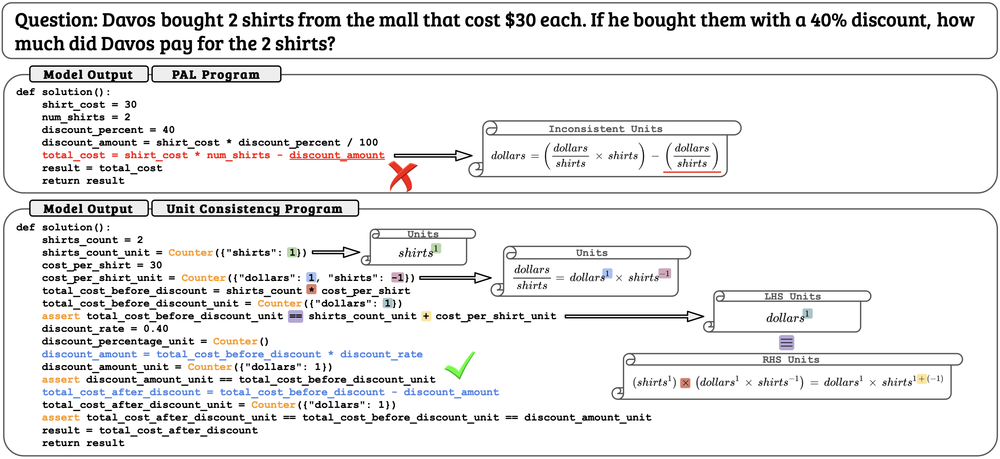

# VerityMath 


Official repo for "[VerityMath: Advancing Mathematical Reasoning by Self-Verification Through Unit Consistency](https://arxiv.org/abs/2311.07172)"

<div align="center">
  
</div>


## Quick Start
```bash
git clone https://github.com/vernontoh/VerityMath
cd VerityMath
pip install -r requirements.txt
```
**NOTE**: You will need **OPENAI KEY** if you want to obtain the annotations yourself.


## Download Datasets from Huggingface
```bash
python download_dataset.py
```

## Generate UCPs Dataset (Optional)
```bash
python generate_annotations.py \
--task program \
--dataset gsm8k \
--model gpt-4-1106-preview \
--openai_key <OPENAI KEY> \
```

## Convert UCPs to HF Dataset (Optional)
```bash
python convert_to_dataset.py \
--dataset_name gsm8k \
--synthetic_data_path gsm8k_program \
--output_data_path gsm8k_ucp_test \
```

## Generate Classification (Optional)
```bash
python generate_annotations.py \
--task classification \
--dataset gsm8k \
--model gpt-3.5-turbo \
--openai_key <OPENAI KEY> \
```

## Finetune with UCPs
```bash
accelerate launch finetune.py \
--load_in_4bit \
--bnb_4bit_use_double_quant \
--model codellama/CodeLlama-7b-hf \
--dataset_name gsm8k_ucp \
--hf_auth_token <AUTH TOKEN> \
```

## Evaluation
```bash
accelerate launch evaluate.py \
--run saved/20231024-180753_CodeLlama-7b-hf_-1_gsm8k_pal \
```


## Acceleration Config
```yaml
compute_environment: LOCAL_MACHINE
distributed_type: MULTI_GPU
downcast_bf16: 'no'
gpu_ids: 0,1,2,3
machine_rank: 0
main_training_function: main
mixed_precision: 'no'
num_machines: 1
num_processes: 4
rdzv_backend: static
same_network: true
tpu_env: []
tpu_use_cluster: false
tpu_use_sudo: false
use_cpu: false
```